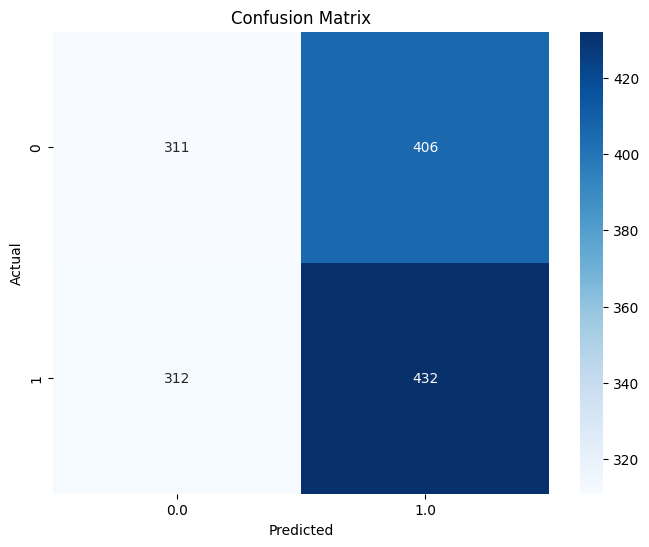
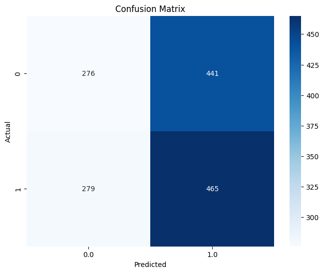
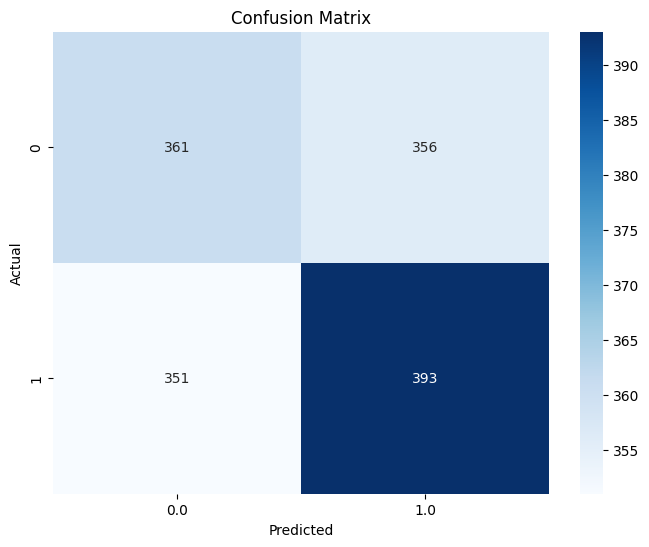
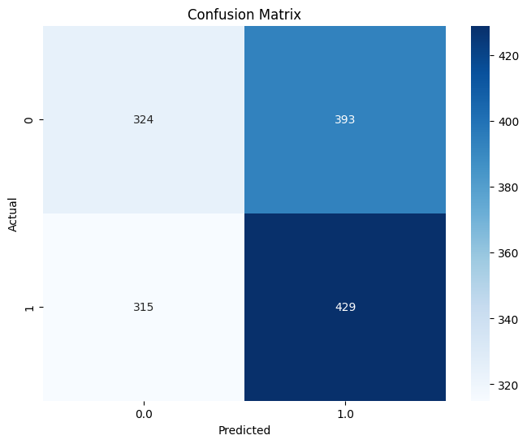

# heart_disease_prediction
This is the result of the model using several predictive algorithm using pyspark.

## Logistic Regression Performance:
- **AUC**: 0.49748241628049905
- **Accuracy**: 0.5085557837097878
- **Precision**: 0.5075060401760884
- **Recall**: 0.5085557837097878
- **F1 Score**: 0.5059189898742478
  

## Random Forest Performance:
- **AUC**: 0.5072668751218486
- **Accuracy**: 0.5071868583162218
- **Precision**: 0.5054185262135001
- **Recall**: 0.5071868583162218
- **F1 Score**: 0.499997534525449
  

## Gradient Boosted Trees Performance:
- **AUC**: 0.5200394415200732
- **Accuracy**: 0.5160848733744011
- **Precision**: 0.5160243767024099
- **Recall**: 0.5160848733744011
- **F1 Score**: 0.5160485825240928
 

## Decision Tree Performance:
- **AUC**: 0.5137820368620746
- **Accuracy**: 0.5154004106776181
- **Precision**: 0.5146073008744474
- **Recall**: 0.5154004106776181
- **F1 Score**: 0.5135313840175488

